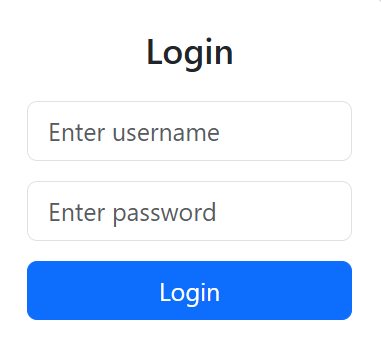
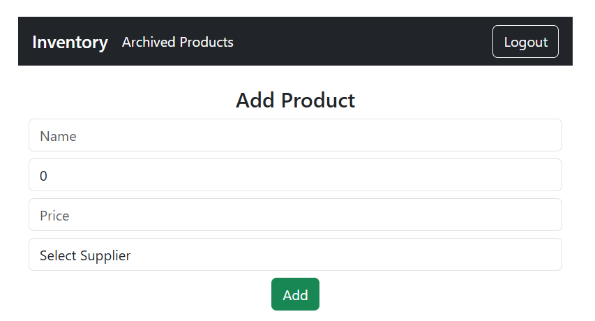
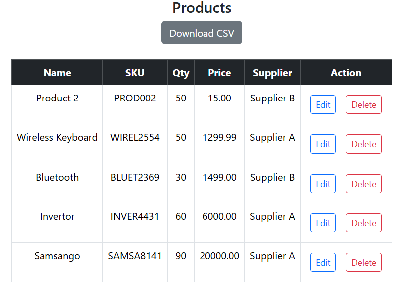
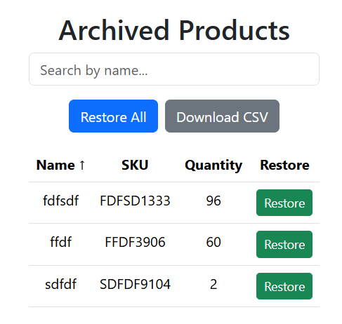

# 📦 Inventory Management System  

A full-stack **Inventory Management System** built with **Django REST Framework** (backend) and **React.js (Vite + Bootstrap)** (frontend).  
This system allows businesses to **manage products, suppliers, transactions, and stock history** with authentication, soft delete, and reporting features.

---

## 🔹 Features  

- 👤 **Authentication** (JWT-based login/logout)  
- 📦 **Product Management** (CRUD with auto-generated SKU)  
- 🏷️ **Supplier Management** (track suppliers and their products)  
- 🔄 **Soft Delete** (archive/restore products without permanent deletion)  
- 📊 **Stock History Logging** (automatically logs every stock update)  
- 🔐 **Transactions** (record stock in / stock out movements)  
- 📥 **Download CSV Reports** for product lists  
- 🔍 **Search, Filter, Sort & Pagination** in product list  
- 📱 **Responsive UI** with Bootstrap  

---

## 🛠️ Tech Stack 

**Frontend**:  
- React.js (Vite)  
- Bootstrap 5  
- Axios (API calls)  
- React Router  

**Backend**:  
- Django 4.x  
- Django REST Framework (DRF)  
- Simple JWT (Authentication)  
- SQLite / PostgreSQL (database)  

---

## ⚙️ Installation  

### Backend (Django + DRF)  
```bash
# Clone repo
git clone https://github.com/pratikraogithub/Inventory_Management_System.git
cd Inventory_Management_System/inventory_project

# Create virtual environment
python -m venv venv
source venv/bin/activate   # (Linux/Mac)
venv\Scripts\activate      # (Windows)

# Install dependencies
pip install -r requirements.txt

# Run migrations
python manage.py migrate

# Create superuser
python manage.py createsuperuser

# Start server
python manage.py runserver
```

### Frontend (React + Vite)  
```bash
cd inventory-frontend

# Install dependencies
npm install

# Start development server
npm run dev
```

---

## 🔑 Usage  

1. Login with credentials (JWT Auth).  
2. Manage products: add, edit, delete (soft delete = archive).  
3. View product stock history (quantity changes).  
4. Record stock transactions (Stock In / Stock Out).  
5. Export product list as **CSV**.  

---

## 📐 System Architecture  

\`\`\`plaintext
[ React Frontend ] <--> [ Django REST API ] <--> [ Database ]
\`\`\`

- React (UI, Axios calls, authentication, CRUD)  
- Django REST Framework (APIs, authentication, business logic)  
- Database (stores products, suppliers, transactions, stock history)  

---

## 📸 Screenshots  


### Login Page


### Dashboard


### Product List with Actions


### Archived Products 



## 🚀 Future Enhancements  

- ✅ Role-based access (Admin vs User)  
- ✅ Dashboard with charts & analytics  
- ✅ Barcode scanning for stock management  
- ✅ Email notifications for low stock  

---

## 👨‍💻 Author  

**Pratik Rao**  
📌 GitHub: [github.com/pratikraogithub](https://github.com/pratikraogithub)  
